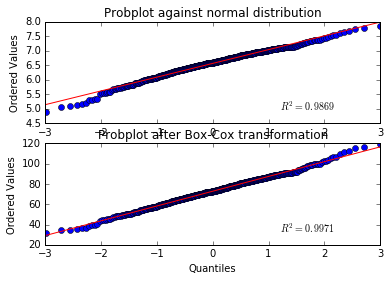

### pynorm

A succinct set of sklearn-esque transformer classes. Including the Box-Cox transformation and the Yeo-Johnson transformation (still under development).

```python
from scipy import stats

## Create a matrix of two-columns
X = np.array([stats.loggamma.rvs(5, size=500) + 5,
              stats.loggamma.rvs(5, size=500) + 5]).transpose()

fig = plt.figure()
ax1 = fig.add_subplot(211)
prob = stats.probplot(X[:,0], dist=stats.norm, plot=ax1)
ax1.set_xlabel('')
ax1.set_title('Probplot against normal distribution')

transformer = BoxCoxTransformer().fit(X)
ax2 = fig.add_subplot(212)
prob = stats.probplot(transformer.transform(X)[:,0], dist=stats.norm, plot=ax2)
ax2.set_title('Probplot after Box-Cox transformation')
```


